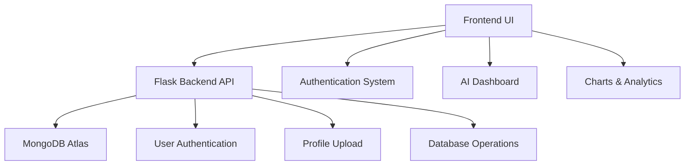

# 🌱 AgriChain Pro

<div align="center">

# 🚀 AI-Powered Smart Agriculture Supply Chain Platform

### Connecting Farmers • Transporters • Vendors


---

### 🌾 Smart Farming • 📊 AI Analytics • 🚚 Intelligent Logistics

</div>

---

# 📸 Project Preview

## 🔐 Authentication System

* Animated Login & Signup
* Floating Particle Background
* Premium Glow Effects
* MongoDB Authentication
* Dynamic Avatar Upload

---

## 📊 Dashboard Features

| 🚜 Farmer          | 🚚 Transporter      | 🏪 Vendor              |
| ------------------ | ------------------- | ---------------------- |
| Crop Inventory     | Route Management    | Market Analytics       |
| AI Recommendations | Delivery Navigation | Revenue Insights       |
| Yield Prediction   | Shipment Tracking   | Profit Margin Analysis |

---

# ✨ Premium Features

# 🔐 Authentication System

✔ Secure Signup & Login
✔ bcrypt Password Hashing
✔ MongoDB Authentication
✔ Login Success Animation
✔ Logout Animation
✔ Dynamic User Avatar
✔ Dropdown Profile Menu
✔ Session Management

---

# 🎨 Modern UI / UX

✔ Premium Sidebar Navigation
✔ Responsive Dashboard Layout
✔ Glassmorphism Effects
✔ Floating Particle Background
✔ Smooth Page Transitions
✔ Animated Buttons & Hover Effects
✔ Dynamic Dashboard Switching
✔ Professional SaaS Styling

---

# 🤖 AI-Powered Features

✔ AI Crop Recommendations
✔ Yield Prediction System
✔ Profit Estimation UI
✔ Risk Assessment
✔ Smart Farming Insights
✔ Real-time Dashboard Analytics

---

# 📈 Data Visualization

✔ Revenue Analytics
✔ Profit Margin Graphs
✔ Crop Demand Visualization
✔ Interactive Charts using Chart.js

---

# 🛠 Tech Stack

<div align="center">

| Frontend   | Backend    | Database      | Libraries    |
| ---------- | ---------- | ------------- | ------------ |
| HTML5      | Flask      | MongoDB Atlas | Chart.js     |
| CSS3       | Python     | NoSQL         | Font Awesome |
| JavaScript | Flask-CORS | Cloud Ready   | bcrypt       |

</div>

---

# 🧠 System Architecture



---

# 📂 Project Structure

```bash
agri-chain-pro/
│
├── backend/
│   ├── app.py
│   ├── config.py
│   ├── requirements.txt
│   ├── .env
│   └── routes/
│       └── auth_routes.py
│
├── frontend/
│   ├── index.html
│   ├── auth.html
│   ├── style.css
│   └── script.js
│
└── README.md
```

---

# ⚙️ Installation Guide

# 1️⃣ Clone Repository

```bash
git clone https://github.com/your-username/agri-chain-pro.git
cd agri-chain-pro
```

---

# 2️⃣ Create Virtual Environment

```bash
python -m venv venv
```

## Activate Environment

### Windows

```bash
venv\Scripts\activate
```

### Linux / Mac

```bash
source venv/bin/activate
```

---

# 3️⃣ Install Dependencies

```bash
pip install -r requirements.txt
```

---

# 4️⃣ Setup Environment Variables

Create `.env` inside backend folder:

```env
MONGO_URI=your_mongodb_connection_string
SECRET_KEY=your_secret_key
```

---

# 5️⃣ Run Flask Server

```bash
python app.py
```

---

# 🌐 Open In Browser

```bash
http://127.0.0.1:5000
```

---

# 📊 Dashboard Analytics

## 🚜 Farmer Dashboard

* Inventory Management
* AI Yield Prediction
* Crop Monitoring
* Market Price Insights

---

## 🚚 Transport Dashboard

* Smart Route Navigation
* Delivery Scheduling
* Shipment Tracking
* Logistics Optimization

---

## 🏪 Vendor Dashboard

* Revenue Analytics
* Profit Margin Visualization
* Procurement Tracking
* Demand Analysis

---

# 🔥 Advanced Features

<div align="center">

| Feature                 | Status |
| ----------------------- | ------ |
| MongoDB Integration     | ✅      |
| AI Recommendation UI    | ✅      |
| Dynamic Avatar Upload   | ✅      |
| Animated Authentication | ✅      |
| Interactive Charts      | ✅      |
| Responsive Dashboard    | ✅      |
| Sidebar Navigation      | ✅      |
| Role-Based UI           | ✅      |

</div>

---

# 🎯 UI Highlights

✨ Animated Glow Effects
✨ Floating Particles
✨ Premium SaaS Design
✨ Responsive Layout
✨ Dynamic User Interface
✨ Interactive Graphs

---

# 📈 Example Analytics

```text
Monthly Revenue Growth

Jan  ████████
Feb  ███████████
Mar  ██████████████
Apr  █████████████████
May  ███████████████████
```

---

# 🔒 Security Features

✔ Environment Variables
✔ Password Hashing
✔ Protected Routes
✔ Secure Authentication Flow
✔ Session Validation

---

# 🚀 Future Enhancements

* JWT Authentication
* Cloudinary Image Storage
* Real AI/ML Model Integration
* Weather API
* Blockchain Supply Tracking
* Mobile Application
* Voice Assistant
* Real-time Notifications

---

# 🧠 Learning Outcomes

This project demonstrates:

✔ Full Stack Development
✔ REST API Integration
✔ MongoDB Database Design
✔ Authentication Systems
✔ Dashboard Architecture
✔ Premium UI/UX Design
✔ SaaS Product Development

---

# 👨‍💻 Developer

# Sounak Maiti

### B.Tech Engineering Student

### Interests:

* 🤖 Artificial Intelligence
* 🌐 Full Stack Development
* 🌾 Smart Agriculture
* 🎨 Modern SaaS UI/UX

---

# ⭐ Support The Project

If you like this project:

```text
⭐ Star the repository
🍴 Fork the project
📢 Share with others
```

---

# 📜 License

This project is licensed under the MIT License.

---

<div align="center">

# 🌍 AgriChain Pro

### Smart Farming • Smart Logistics • Smart Future

🚀 Built with Passion & Innovation

</div>
